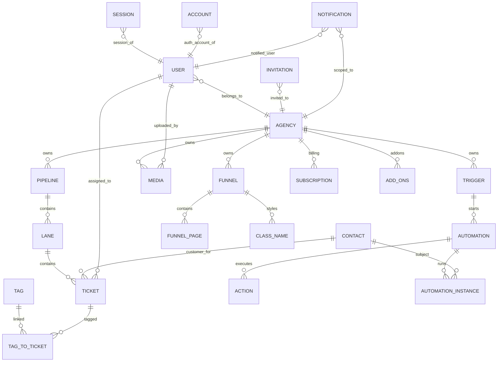

# Tinybox

## Table of Contents

- [Project Explanation](#project-explanation)
- [Core Capabilities](#core-capabilities)
- [Architecture at a Glance](#architecture-at-a-glance)
- [Getting Started](#getting-started)
  - [Prerequisites](#prerequisites)
  - [Installation](#installation)
  - [Usage](#usage)
- [Database Schema](#database-schema)
  - [Schema Diagram](#schema-diagram)
  - [Schema Breakdown](#schema-breakdown)
- [Query Layer](#query-layer)
  - [How Queries Are Organized](#how-queries-are-organized)
  - [Read Patterns](#read-patterns)
  - [Write Patterns](#write-patterns)
  - [Data Integrity Patterns](#data-integrity-patterns)
- [Roadmap](#roadmap)
- [Contributing and License](#contributing-and-license)

## Project Explanation

Tinybox is a multi-tenant B2B SaaS platform that helps agencies and similar businesses run their client-facing digital operations from one place.

At a product level, Tinybox is designed around the idea that a business should be able to:

- publish and manage website/funnel experiences for each brand or client workspace,
- store and organize media assets for those experiences,
- collaborate with internal team members using role-based access,
- manage pipelines, lanes, tickets, and contacts as part of day-to-day operations,
- and connect monetization/billing flows as the product matures.

Each agency in Tinybox has its own isolated workspace (data, users, funnels, media, automations, and CRM pipeline records). That isolation is what makes Tinybox suitable as a B2B platform: one deployed app can serve many business tenants while keeping data segmented by agency.

The current implementation already includes the operational foundation for this model:

- authentication and sessions via Better Auth,
- relational data model with Drizzle ORM + PostgreSQL,
- an App Router based Next.js application with server-side data access,
- funnel publishing routes for domain-based page rendering,
- and collaboration primitives like invitations, team roles, notifications, and sidebar/workspace configuration.

## Core Capabilities

- **Agency workspaces:** create and manage organization-level settings and branding context.
- **Team collaboration:** invite members, assign roles, and scope users to an agency.
- **Funnels and pages:** create funnel structures with ordered pages and published content.
- **CRM workflows:** manage pipelines, lanes, and tickets tied to contacts and tags.
- **Media management:** persist media metadata and associate uploaded assets with agencies.
- **Automation foundations:** model triggers, automations, actions, and execution instances.
- **Subscription foundations:** persist Stripe-related subscription fields and plan metadata.

## Architecture at a Glance

- **Frontend and app framework:** Next.js (App Router), React, TypeScript, Tailwind CSS.
- **Database and ORM:** PostgreSQL + Drizzle ORM (`src/lib/db/schema.ts`, `src/lib/db/index.ts`).
- **Auth:** Better Auth with Drizzle adapter (`src/lib/auth.ts`, `src/lib/auth-server.ts`).
- **Server data access:** centralized query/action module (`src/lib/queries.ts`).
- **Runtime model:** multi-tenant by `agencyId` across almost all business entities.

## Getting Started

### Prerequisites

- Bun (recommended package manager for this repo).
- Docker (recommended, for local PostgreSQL via `docker-compose.yml`) or an existing PostgreSQL instance.
- Node.js 20+ (for ecosystem/tooling compatibility).

### Installation

1. Clone the repository and enter the project directory.
2. Install dependencies:

```bash
bun install
```

3. Create your local environment file:

```bash
cp .env .env.local
```

4. Update `.env.local` values for your environment:

- `DATABASE_URL`
- `BETTER_AUTH_SECRET`
- `BETTER_AUTH_URL`
- Stripe keys (if testing billing-related paths)
- UploadThing keys (if testing file upload flows)
- app URL/domain values

5. Start PostgreSQL (Docker option):

```bash
bun run db:up
```

6. Push the schema to your database:

```bash
bun run db:push
```

7. Start the app:

```bash
bun dev
```

The app runs at [http://localhost:3000](http://localhost:3000).

### Usage

Once the app is running:

- sign up or sign in from the agency auth routes,
- initialize or select an agency workspace,
- manage team members, contacts, pipelines, and funnels from the agency dashboard routes,
- access published funnel experiences through domain routes once subdomain/domain data is configured.

Useful commands:

- `bun dev` - start development server
- `bun run build` - production build
- `bun start` - run production build
- `bun run lint` - lint code
- `bun run db:push` - sync schema to DB
- `bun run db:studio` - open Drizzle Studio
- `bun run db:down` - stop local DB container

## Database Schema

The schema is defined in `src/lib/db/schema.ts` using Drizzle's typed PostgreSQL table definitions and explicit relations.

### Schema Diagram



### Schema Breakdown

- **Identity and access:** `user`, `session`, `account`, `verification`, and `invitation` support auth plus role-based workspace membership.
- **Tenant root:** `agency` is the primary tenancy boundary; most business tables include `agencyId`.
- **CRM and deal flow:** `pipeline`, `lane`, `ticket`, `tag`, `tag_to_ticket`, and `contact` model lead/deal progression.
- **Website/funnel publishing:** `funnel`, `funnel_page`, and `class_name` model editable funnel content and route-able pages.
- **Media system:** `media` stores metadata for uploaded files and links them to agency and uploader context.
- **Automation domain:** `trigger`, `automation`, `action`, and `automation_instance` support rule-driven behavior.
- **Operational UX:** `agency_sidebar_option` and `notification` support per-tenant navigation and activity signals.
- **Billing model:** `subscription` and `add_ons` persist Stripe-compatible plan and subscription state fields.

## Query Layer

The query layer is concentrated in `src/lib/queries.ts` and acts as the application service/data-access boundary.

### How Queries Are Organized

- Functions are grouped by domain capability (users, agencies, pipelines, tickets, funnels, contacts, media).
- Reads and writes are co-located near each other for each domain to keep workflows traceable.
- Server-side auth context is pulled with `getCurrentUser()` where identity-aware behavior is needed.
- Query helpers return normalized shapes when UI consumers need denormalized data (for example ticket tags).

### Read Patterns

- Uses Drizzle relational query API (`db.query.<table>.findFirst/findMany`) with `with` for eager relation loading.
- Uses explicit ordering for deterministic UI behavior (`asc`, `desc`) in lists and board/page ordering.
- Uses targeted predicates (`eq`, `and`, `like`) for tenancy filters and search.
- Domain rendering routes fetch published funnel data by subdomain/path and then hydrate editor content.

### Write Patterns

- Many writes use an **upsert-style function pattern**:
  - generate ID when absent,
  - check existing row,
  - update if present, insert if absent.
- Side effects are embedded where required, such as activity log notifications after changes.
- Revalidation hooks are used for content updates that affect rendered routes (`revalidatePath`).

### Data Integrity Patterns

- Ordered collections (lanes, tickets, funnel pages) are updated with transaction-backed reorder functions.
- Join-table handling is explicit (`tag_to_ticket`) to avoid stale many-to-many links.
- Foreign keys with `cascade` and `set null` behavior in the schema handle cleanup and historical association safely.
- Tenant scoping is reflected in function signatures and query predicates through `agencyId`.

## Roadmap

- Stripe integration
  - complete billing checkout/subscription lifecycle and replace dashboard placeholders with live revenue metrics.
- UploadThing integration
  - implement end-to-end upload pipeline for agency media with secure signed upload flows.
- Shopify integration
  - connect storefront/product data for funnel commerce use cases and synchronized catalog workflows.
- Language support
  - add internationalization (UI locale switching, translated content, localized formatting).

## Contributing and License

Contributions are welcome and should follow a standard open-source workflow:

1. Fork the repository.
2. Create a feature branch.
3. Make focused changes with clear commit messages.
4. Run linting and schema-related commands if your changes touch those areas.
5. Open a pull request with context, screenshots (if UI), and migration notes (if DB changes).

When contributing, your code is expected to be submitted under the same license as this project (the repository's standard license). If you maintain this repository, add a top-level `LICENSE` file so contribution terms are explicit for all contributors.
